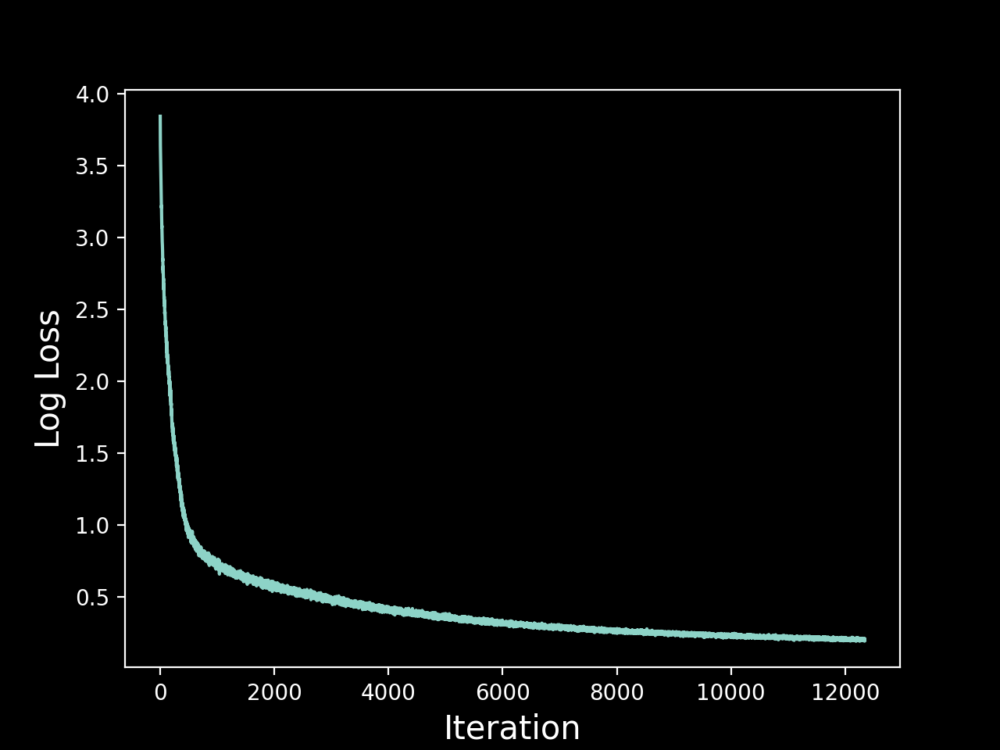

# 🎼 Bach Chorales

The Bach Chorales dataset consists of 382 chorales composed by Johann Sebastian Bach. Each chorale is 100 to 640 time steps long, where each time step contains 4 integers that correspond to a note's index on a piano (except for the value 0, which corresponds to a rest).

I trained a GPT model to generate new Bach Chorales by predicting the next note in sequences of arpeggios. The model had 24 self-attention blocks, each consisting of 8 attention heads and an embedding size of 64. total number of parameters was 622,383.

## Loss History

## Example Generations

Here are some example generations that are seeded with two chords from a random Bach Chorale from the test set. 

♫ [temperature = 0.5](https://user-images.githubusercontent.com/10998105/232264858-a13f98a8-5159-4215-9d23-b3c9bb98de28.mp4)

♬ [temperature = 1.5](https://user-images.githubusercontent.com/10998105/232264882-13c95d6e-a7a6-45fb-b423-4fd8929dc215.mp4)

🎶 [temperature = 1.8](https://user-images.githubusercontent.com/10998105/232264893-2426c93d-401c-4191-9154-c9ef8f61c27e.mp4)
