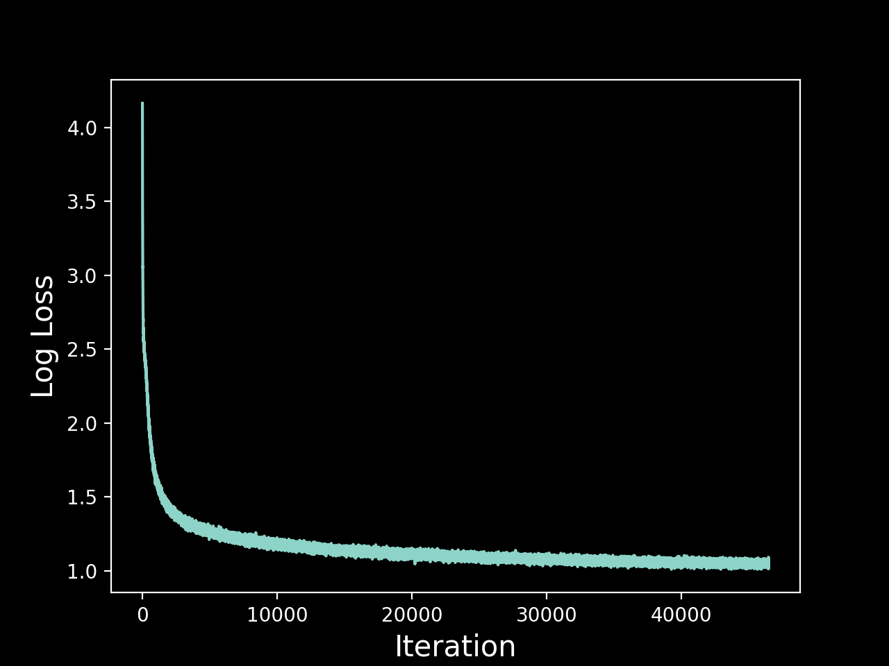

# 📜 Tiny Shakespeare

To test `midiGPT` during the development, I trained the model on [Andrej Karpathy](https://karpathy.ai)'s [Tiny Shakespeare Dataset](https://github.com/karpathy/char-rnn/blob/master/data/tinyshakespeare/input.txt). The training script is contained in [train.py](train.py) in this directory.

## Loss History



## Sample Generation
```
KING JOHNNY:
To be, or not to be: that is the question.
Gentlemen, give me the clothes to wail,
And what I am to receive: to resist this war
To bear himself of God, my worship forth;
Have caught up my state, which have we stood
To take enforce the stones?

First Senator:
Leave nothing to't, my lord; and let them alone
By such affection of God's hazard hence to grow
Is Rutland and by some secret bosom they.
There's claudious that might be-charm
That censured for consulships,--this hour
Shall be look'd for't: or two days of witchcraments,
Stabbing that you of what my power, that I
Can tell, that what you was not yet speak
Your brother in Marcius: O this being near of Rome,
This same most dear Coriolanus,
His eye, or his appearful worse. Let him say
You have been men in flint: and smells all shall tear
The fools of your tale.

Clown:
You are come from every queen's house and are
Married with your daughter.
```